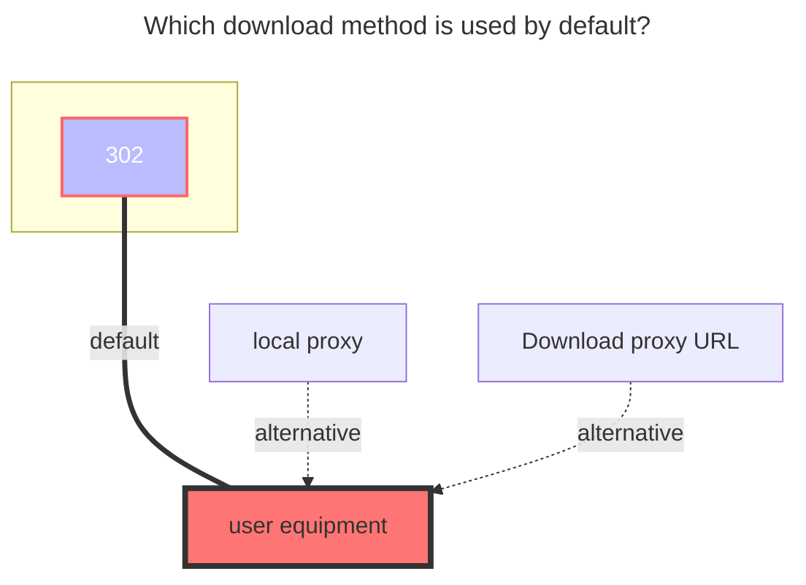

---
# This is the title of the article
title: teldrive
# This is the icon of the page
icon: iconfont icon-state
# This control sidebar order
order: 214
# A page can have multiple categories
category:
  - Guide
# A page can have multiple tags
tag:
  - Storage
  - Guide
  - "302"
# this page is sticky in article list
sticky: true
# this page will appear in starred articles
star: true
---

# Teldrive

Teldrive is a telegram based cloud storage, which is maintained by telegram official team.

**features:**
- No storage limit
- no file size limit. 
- Bandwidth limited applied if your account is not subscribe Telegram Premium. Speed depends on the distance from teldrive service to your account datacenter location(DC1-DC5).  

Official repository: [teldrive](https://github.com/tgdrive/teldrive)

Setup guide: [teldrive Installation](https://teldrive-docs.pages.dev/docs/getting-started/prerequisites)

## Parameters

### Address
Your teldrive backend url without suffix dash.

Example: `https://teldrive.example.com`

### Authentication
Only support `Cookie` authentication.

You can get cookie from your browser after login to teldrive web interface.

It should start with `access_token=xxx.xxx.xxx`, which is jwt token format style.

::: tip
Only the string with access_token= is required.
:::

### Chunk Size
Upload chunk size in MiB.

Default is `10` (10MiB). You can set it to a smaller value if you have issues with large files.

if chunk size is bigger than file size, it will not split the file, and upload it as a whole with single thread.

### Concurrency
Upload concurrency, default is `4`.

You should limit the concurrency with your machine actual memory, by calculating `chunk size * concurrency`.

## Download
**Notice: If webdav 302 is enabled, it will create share file and public the download link with 1 hour expiration time.**

Otherwise, it will use the default local proxy by AlistGo.

## **The default download method used**

