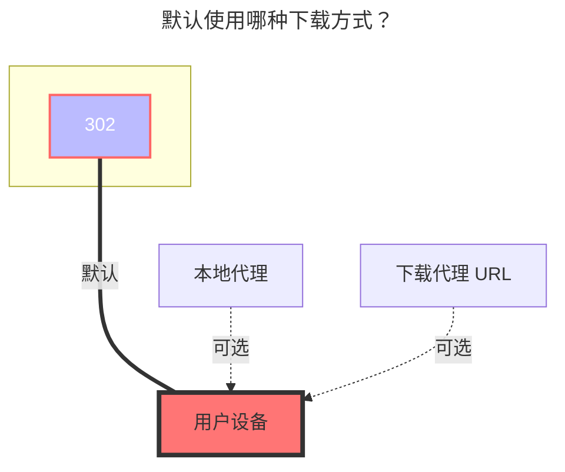

---
# 这是文章标题  
title: teldrive 
# 这是页面的图标  
icon: iconfont icon-state
# 控制侧边栏的顺序  
order: 214  
# 页面可以有多个分类  
category:  
  - 指南  
# 页面可以有多个标签  
tag:  
  - 存储  
  - 指南  
  - "302"  
# 该页面会在文章列表中置顶  
sticky: true  
# 该页面会出现在加星的文章中  
star: true  
---

# Teldrive

Teldrive 是一个基于 Telegram 的云存储服务，由 Telegram 官方团队维护。

**功能特点：**
- 无限存储空间
- 无文件大小限制
- 如果未订阅 Telegram Premium，将受到带宽限制。速度取决于 Teldrive 服务与你账户的数据中心（DC1–DC5）之间的距离。

官方仓库：[teldrive](https://github.com/tgdrive/teldrive)

安装指南：[teldrive 安装教程](https://teldrive-docs.pages.dev/docs/getting-started/prerequisites)

## 参数说明

### 地址
填写你的 teldrive 后端网址，不要包含后缀的短横线。  
例如：`https://teldrive.example.com`

### 认证
仅支持 `Cookie` 方式认证。

你可以在登录 Teldrive 网页端后，通过浏览器获取 Cookie。

Cookie 应以 `access_token=` 开头，这是一个 JWT 格式的 Token。

::: tip  
只需要包含 `access_token=` 的那一串字符串。  
:::

### 分块大小
上传时的分块大小，单位为 MiB。

默认值为 `10`（即 10MiB）。如果上传大文件出现问题，可以设置为更小的值。

如果分块大小大于文件本身大小，则不会进行分块，整个文件将通过单线程上传。

### 并发数量
上传时的并发线程数，默认值为 `4`。

你应根据实际内存情况调整并发数，计算方式为：`分块大小 × 并发数`。

## 下载方式

**注意：如果启用了 WebDAV 302 重定向，将会生成共享文件链接，下载链接的有效期为 1 小时。**

否则，默认会使用 AlistGo 提供的本地代理方式。

## 默认使用的下载方式

